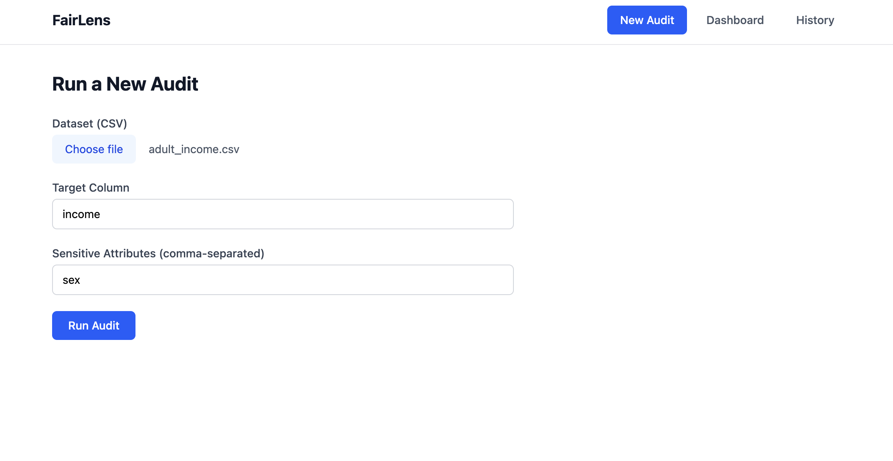
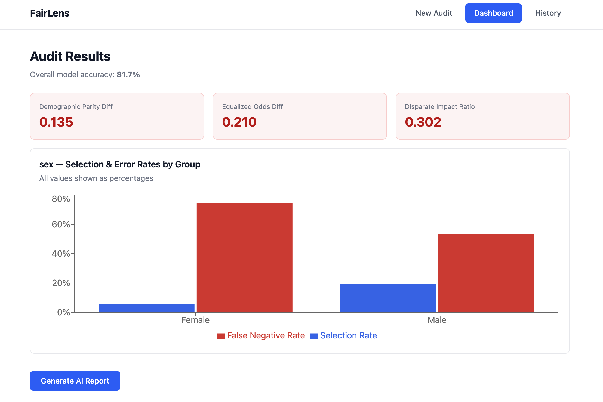
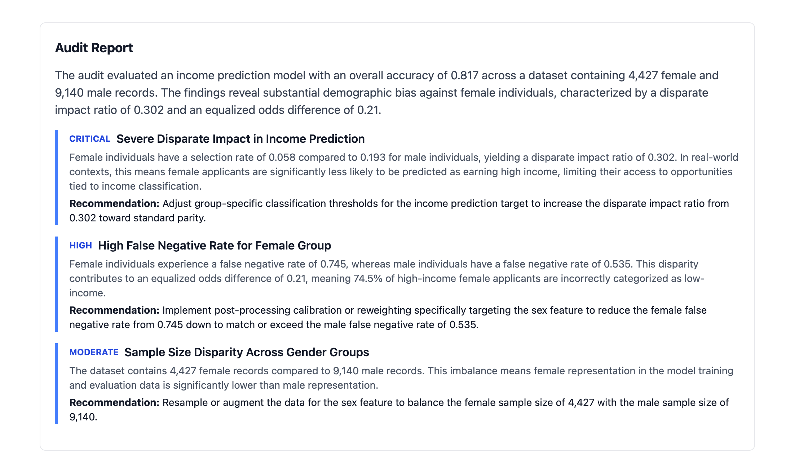

# FairLens

**A full-stack platform to measure, flag, and fix hidden bias in datasets and the classifiers trained on them.**

🔗 **Live app:** [fairlens-ai-bias.vercel.app](https://fairlens-ai-bias.vercel.app)
🔗 **API:** [fairlens-ai-bias-zgxi.onrender.com/docs](https://fairlens-ai-bias-zgxi.onrender.com/docs)

> First request may take 30–60s — the backend is hosted on Render's free tier, which spins down after ~15 minutes of inactivity.

## Screenshots

**Running an audit:**


**Results dashboard — real bias detected and flagged:**


**Evidence-constrained AI report — every finding cites a real computed metric:**



---

## What it does

FairLens audits a tabular classifier for demographic bias, lets you apply real mitigation techniques to reduce that bias, and generates a plain-language report explaining the findings  which are grounded **strictly** in the numbers the engine actually computed.

1. **Measure** : upload a CSV, pick a target column and sensitive attribute(s). FairLens trains a baseline classifier and computes demographic parity difference, equalized odds difference, and disparate impact ratio per subgroup, using [Fairlearn](https://fairlearn.org/).
2. **Flag** : results are visualized with per-group selection/error rates, and any metric past a recognized fairness threshold (e.g. the EEOC's 0.8 disparate impact rule) is flagged.
3. **Fix** : apply `ThresholdOptimizer` (post-processing) or `ExponentiatedGradient` (in-processing) mitigation, and see the real accuracy–fairness tradeoff, not a hand-wavy "balance your data" suggestion.
4. **Explain** : Gemini generates a plain-language report, but it only narrates numbers that are actually present in the computed JSON. Every finding is validated against the source metrics before being shown.

---

## The core design decision: Gemini narrates, it never computes

Every fairness number in this app — demographic parity, equalized odds, disparate impact, the WEAT effect size, comes from Fairlearn or a direct statistical computation. **Gemini is never asked to judge whether something is biased.** Its only job is turning an already computed JSON object into readable prose, and every generated finding is checked against that source JSON. If a cited number doesn't trace back to something real, it's flagged as unvalidated rather than silently shown.

This also means the app degrades gracefully: if the LLM is fully unreachable, the audit still returns valid, complete fairness metrics. The narrative layer is a convenience, not a dependency.

---

## Architecture

```
┌─────────────┐      ┌──────────────┐      ┌─────────────────────┐
│   React     │─────▶│   FastAPI    │─────▶│  Fairlearn engine   │
│  (Vercel)   │      │   (Render)   │      │  - audit (metrics)  │
└─────────────┘      │              │      │  - mitigation       │
                     │              │      │  - text bias (WEAT) │
                     │              │      └─────────────────────┘
                     │              │      ┌──────────────────────┐
                     │              │─────▶│  Gemini (evidence-   │
                     │              │      │  constrained reports)│
                     │              │      └──────────────────────┘
                     │              │      ┌──────────────────────┐
                     │              │─────▶│  PostgreSQL (Neon)   │
                     └──────────────┘      │  audit/report history│
                                           └──────────────────────┘
```

--- 

## Tech stack

| Layer | Tools |
|---|---|
| Fairness engine | Fairlearn, scikit-learn, sentence-transformers (WEAT) |
| LLM layer | Gemini 2.5 Flash, via a swappable provider interface |
| Backend | FastAPI, SQLAlchemy, Alembic |
| Database | PostgreSQL (Neon) |
| Frontend | React, Vite, Tailwind CSS, React Router, Recharts |
| Deployment | Docker on Render (backend), Vercel (frontend) |

---

## Validated results

Run against the [UCI Adult Income dataset](https://archive.ics.uci.edu/dataset/2/adult) (predicting >$50K income):

- **Detected bias:** disparate impact ratio of **0.32** by sex, **0.30** by race, both well below the 0.8 threshold commonly used as a legal reference point for adverse impact.
- **Mitigation:** `ExponentiatedGradient` reduced the demographic parity gap from 0.119 to 0.004 at a 2.2-point accuracy cost, outperforming `ThresholdOptimizer` on both fairness and accuracy retention in this test.
- **Text bias:** the classic WEAT career/family gender association test reproduced a known literature result (effect size 1.23, "large" association bias), validating the embedding-bias module against a published benchmark.

---

## Known limitations

- Uploaded datasets are not persisted across backend restarts (Render free tier has an ephemeral filesystem), audits and reports in the database do persist, but the original uploaded file does not.
- Mitigation currently constrains on one sensitive attribute at a time, per Fairlearn's design (this is a property of the underlying optimization, not a missing feature).
- The UI is intentionally functional over polished, effort went into the correctness of the fairness engine and the evidence constrained LLM layer first.

---

## Running locally

**Backend:**
```bash
cd backend
python -m venv venv && source venv/bin/activate
pip install -r requirements.txt
# set DATABASE_URL and GEMINI_API_KEY in a .env file
alembic upgrade head
uvicorn app.main:app --reload
```

**Frontend:**
```bash
cd frontend
npm install
npm run dev
```

---

## Project structure

```
fairlens/
├── backend/
│   ├── app/
│   │   ├── core/      # database, models, crud
│   │   ├── engine/     # fairness logic: validation, metrics, mitigation, text bias, report
│   │   ├── schemas/    # Pydantic request/response contracts
│   │   └── main.py     # FastAPI app
│   ├── alembic/        # DB migrations
│   └── tests/
└── frontend/
    └── src/
        ├── pages/       # New Audit, Dashboard, History
        ├── components/  # charts, stat cards, nav
        ├── context/     # shared audit/report state
        └── api/         # backend client
```